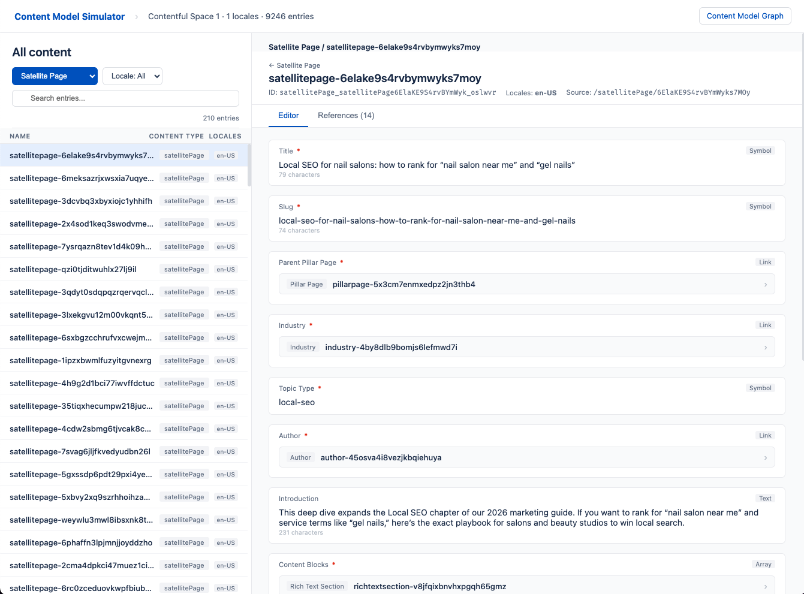
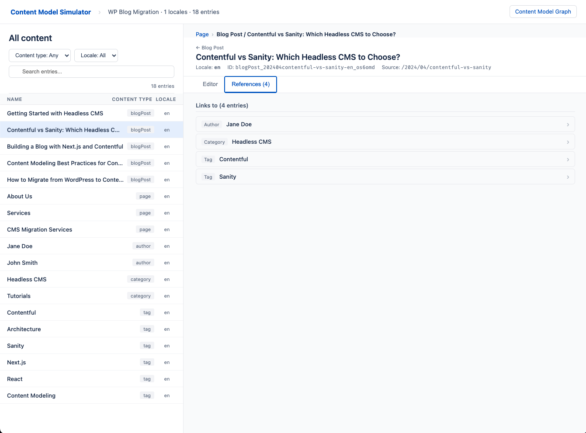
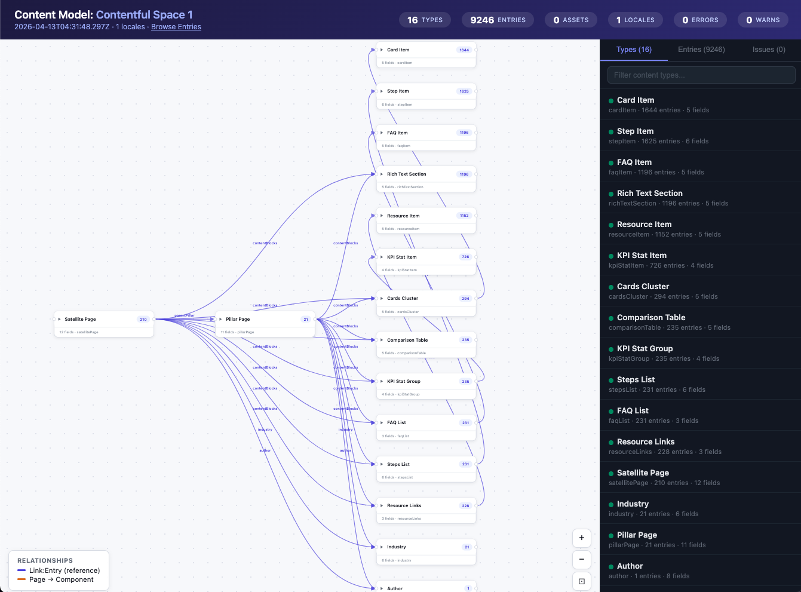
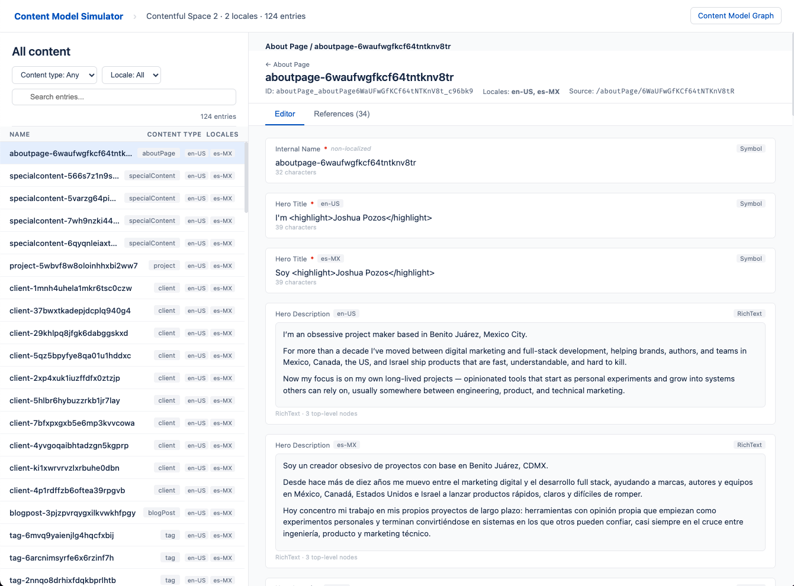

# content-model-simulator

[](https://www.npmjs.com/package/content-model-simulator)


**Preview Contentful content models locally before touching your real space.**

Stop iterating blind. Simulate content types, entries, references, and validation errors entirely offline — catch mistakes before they hit production, not after.

<p align="center">
  
</p>

## Why this exists

If you work with Contentful, you know the friction:

- You design a content model, push it, realize a field is wrong, roll back, try again
- You plan a CMS migration, but can't see how the data will actually look in Contentful until you import it
- You change a content type and have no idea if existing entries will break

This tool lets you **simulate everything locally first**. Define your schemas, point at your data (or let it generate mock data), and get an interactive preview that looks like the real Contentful dashboard — without uploading anything.

## 30-second quick start

```bash
npx cms-sim init my-project
cd my-project
npx cms-sim --schemas=schemas/ --open
```

That's it. You now have a local Contentful preview with mock entries in your browser.

## Who this is for

- **Content architects** designing or iterating on Contentful content models
- **Developers** planning a migration from WordPress, Sanity, or another CMS to Contentful
- **Teams** that want to validate content model changes before deploying them

## Who this is NOT for

- Running the actual migration (use `contentful-migration`, `contentful-import`, or the Management API for that)
- Editing content (this is read-only simulation, not a CMS)
- Non-Contentful platforms (schemas use the exact Contentful format)

## What you get

<table>
<tr>
<td width="50%">

### Content Browser

Browse entries exactly like in Contentful. Filter by content type and locale, inspect every field, follow references between entries.

</td>
<td width="50%">

### Content Model Graph

Interactive SVG diagram of your content types and their relationships. Zoom, pan, drag. See the full picture at a glance.

</td>
</tr>
<tr>
<td>

</td>
<td>

</td>
</tr>
</table>

<details>
<summary><strong>Multi-locale support</strong> — see how localized content renders per locale</summary>
<br/>

</details>

## Core capabilities

| Capability | What it does |
|---|---|
| **Offline simulation** | 10-step pipeline: load → validate → transform → link → resolve → convert → merge → validate → stats → report. Zero network calls. |
| **Contentful validation** | Catches missing required fields, unknown fields, unresolved links, field type mismatches — the same errors Contentful would reject. |
| **Pull from Contentful** | `cms-sim pull` downloads your existing content model and entries (read-only CDA token). Modify locally, simulate, then apply when ready. |
| **Mock data generator** | No data? No problem. Auto-generates realistic entries from your schemas with field-type-aware values and cross-references. |
| **CMS migration preview** | Feed WordPress XML, Sanity NDJSON, or generic JSON exports alongside your Contentful schemas. See exactly how the migrated content will look. |
| **CI/CD validation** | `cms-sim validate --json` for pipelines. Exit code 1 on errors. |

## Three workflows

### 1. Design a content model (no data needed)

```bash
npx cms-sim --schemas=schemas/ --open
npx cms-sim --schemas=schemas/ --locales=en,es,fr --entries-per-type=10 --open
```

### 2. Work with your existing Contentful model

```bash
# Download your current model (read-only)
npx cms-sim pull --space-id=YOUR_SPACE --access-token=YOUR_CDA_TOKEN --output=my-project/

# Preview locally, modify schemas, re-run
npx cms-sim --schemas=my-project/schemas/ --open

# With real entries
npx cms-sim pull --space-id=abc123 --access-token=TOKEN --include-entries --output=my-project/
npx cms-sim --schemas=my-project/schemas/ --input=my-project/data/entries.ndjson --open
```

### 3. Preview a CMS migration

```bash
# WordPress XML
npx cms-sim --schemas=schemas/ --input=data/export.xml --open

# Sanity NDJSON
npx cms-sim --schemas=schemas/ --input=data/export.ndjson --transforms=transforms/ --open

# Auto-scaffold schemas from WordPress
npx cms-sim scaffold --input=data/export.xml --output=my-project/
```

## What this tool does NOT do

- **Does NOT upload, create, or modify anything** in your Contentful space
- **Does NOT run migrations** — that's `contentful-migration` / `contentful-import`
- **Does NOT make network calls** during simulation — `cms-sim pull` is the only command that reads from Contentful (read-only CDA token)

> **This is a simulation tool, not a migration tool.** Once your simulation looks correct, you use Contentful's own tools to perform the actual migration.

---

## CLI Reference

### Simulate (default)

```
cms-sim --schemas=<dir> [options]

REQUIRED:
  --schemas=<dir>        Content type definitions directory (.js/.mjs/.json)

DATA SOURCE (optional):
  --input=<path>         Source data (NDJSON, JSON, XML, or directory)
                         If omitted, mock entries are auto-generated

OPTIONS:
  --transforms=<dir>     Custom transformer modules directory
  --plugins=<dir>        Plugin directory (auto-discovers schemas/, transforms/, setup files)
  --config=<file>        JSON config file (cms-sim.config.json)
  --output=<dir>         Output directory (default: ./output/<name>_<timestamp>)
  --name=<string>        Project name
  --base-locale=<code>   Base locale (default: en)
  --locales=<list>       Comma-separated locale codes
  --locale-map=<file>    JSON file mapping source → target locale codes
  --entries-per-type=<n> Mock entries per content type (default: 3)
  --content-type=<id>    Filter to a specific content type
  --format=<fmt>         Input format: ndjson, json-array, json-dir, wxr, sanity, auto (default: auto)
  --json                 JSON output only (skip HTML)
  --open                 Auto-open in browser
  --watch, -w            Re-run on file changes with browser auto-reload
  --template-css=<file>  Custom CSS for HTML output
  --template-head=<file> Custom HTML for <head>
  --verbose, -v          Verbose logging
  --help, -h             Show help
```

### Pull

```
cms-sim pull --space-id=<id> --access-token=<token> [options]

  --environment=<env>    Environment (default: master)
  --output=<dir>         Output directory (default: ./contentful-export)
  --include-entries      Download published entries
  --include-assets       Download asset files
  --max-entries=<n>      Max entries (default: 1000)
  --content-type=<id>    Filter entries by content type
  --preview              Use Content Preview API (drafts)
```

### Validate

```
cms-sim validate --schemas=<dir> [options]

Exits with code 1 if errors found. Use --json for machine-readable output.
```

### Diff

```
cms-sim diff --old=<dir> --new=<dir> [--json]

Compare two schema directories or simulation outputs.
```

### Init & Scaffold

```
cms-sim init [<name>]              # Scaffold a new project with example schemas
cms-sim scaffold --input=<file.xml> # Auto-generate schemas from WordPress XML
```

> **Security:** `cms-sim pull` only reads from Contentful — never writes. Schema and transform files are loaded via dynamic `import()`. Only point `--schemas` / `--transforms` at directories you trust.

## Programmatic API

```js
import {
  simulate, generateMockData, SchemaRegistry,
  generateContentBrowserHTML, generateModelGraphHTML, writeReport,
} from 'content-model-simulator';

// Load schemas
const schemas = new SchemaRegistry();
await schemas.loadFromDirectory('./schemas');

// Generate mock data (or use readDocuments() for real data)
const { documents, assets } = generateMockData(schemas, {
  entriesPerType: 5,
  locales: ['en', 'es'],
});

// Simulate
const report = simulate({
  documents, schemas, assets,
  options: { name: 'my-model', locales: ['en', 'es'] },
});

// Write outputs
writeReport(report, './output');
fs.writeFileSync('./output/content-browser.html', generateContentBrowserHTML(report));
fs.writeFileSync('./output/visual-report.html', generateModelGraphHTML(report));
```

Full API exports: `simulate`, `readDocuments`, `readDocumentsStream`, `SchemaRegistry`, `TransformerRegistry`, `generateMockData`, `generateContentBrowserHTML`, `generateModelGraphHTML`, `writeReport`, `diffSchemas`, `diffReports`, `pullContentful`, `readWXR`, `parseWXR`, `readSanity`, `parseSanity`, `htmlToRichText`, `looksLikeHTML`, `isRichTextDocument`, `stripGutenbergComments`.

## Content Type Schema Format

```js
// schemas/blogPost.js
export default {
  id: 'blogPost',
  name: 'Blog Post',
  displayField: 'title',
  fields: [
    { id: 'title', name: 'Title', type: 'Symbol', required: true, localized: true },
    { id: 'body', name: 'Body', type: 'RichText', required: true, localized: true },
    { id: 'author', name: 'Author', type: 'Link', linkType: 'Entry' },
    { id: 'heroImage', name: 'Hero Image', type: 'Link', linkType: 'Asset' },
    { id: 'tags', name: 'Tags', type: 'Array', items: { type: 'Symbol' } },
  ],
};
```

Schemas can be `.js` (ESM default export), `.mjs`, or `.json` files. Uses the exact Contentful content type definition format.

## Custom Transformers

```js
// transforms/event.js
export function register(registry) {
  registry.register('sourceType', (doc, locale, options) => ({
    id: `event-${doc.data.slug}-${locale}`,
    contentType: 'event',
    locale,
    fields: {
      title: { [locale]: doc.data.eventName },
      date: { [locale]: new Date(doc.data.timestamp).toISOString() },
    },
  }), 'event');
}
```

## Config File

```json
{
  "name": "my-project",
  "input": "./data/export.ndjson",
  "schemas": "./schemas",
  "transforms": "./transforms",
  "baseLocale": "en",
  "locales": ["en", "es", "fr"],
  "localeMap": { "en_US": "en", "es_MX": "es" }
}
```

## Output Structure

```
output/my-project_2026-04-12/
├── content-types/        # CT definition JSON files
├── entries/              # Entries grouped by content type
├── assets.json           # Extracted assets
├── validation-report.json
├── manifest.json         # Summary stats
├── content-browser.html  # Interactive entry browser
└── visual-report.html    # Content model graph
```

## CMS Migration Guides

| Source CMS | Guide |
|---|---|
| WordPress | [examples/wordpress/](examples/wordpress/) — end-to-end with real Gutenberg data |
| Sanity | [examples/sanity/](examples/sanity/) — end-to-end with multi-locale NDJSON |

## License

MIT
